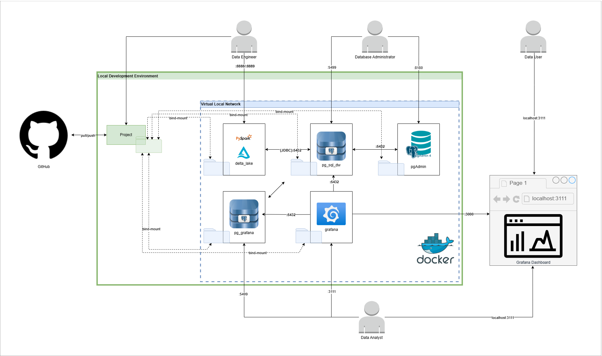
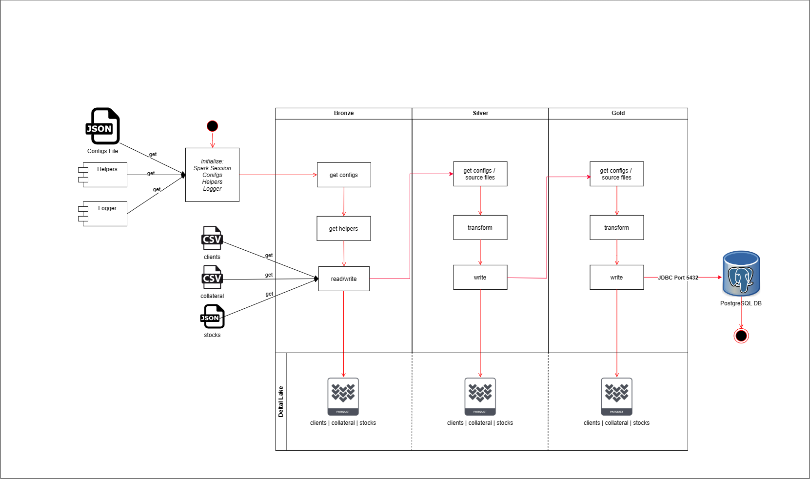
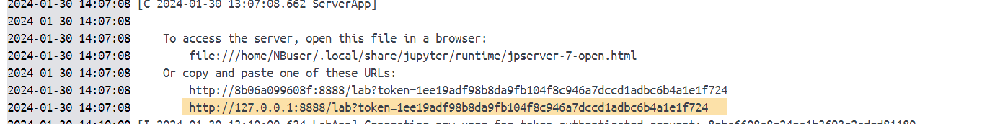
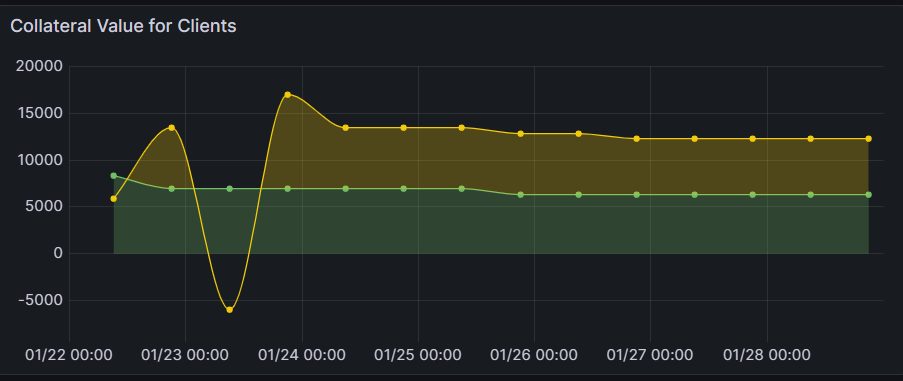

# Credit Lending Project

## Introduction
This README file explains the architecture and design of a credit lending application that uses Docker Compose for the platform setup and PySpark for the data pipeline. It also contains a quickstart on how to setup the application and run it. Finally you will see a demo of the credit lending product.

## Architechture
The architechture of this product is split into two layers:
1. __Control Plane Architechture__ - platform setup
2. __Data Plane Architechture__ - data flow setup

### Control Plane Architechture



The above diagram shows the platform setup of the Credit Lending Application. The main components and their interactions are as follows:

* __GitHub__: a developer platform that allows developers to create, store, manage and share their code. For this application, GitHub is used to store source code.
* __Docker__: a platform for developing, shipping, and running applications using containers. For this application, we use Docker Compose to deploy our multi-container de-coupled application.
* __PySpark__: is the Python API for Apache Spark. It enables developers to perform real-time, large-scale data processing in a distributed environment using Python. It also provides a PySpark shell for interactively analyzing your data. The Credit Lending Application uses the PySpark API to read, write, query and manipulate data.
* __Delta Lake__: is an open source project that enables building a lakehouse architecture on top of data lakes. It provides ACID transactions, scalable metadata handling, and unifies streaming and batch data processing. This application uses Delta Lake to store and manage data.
* __PostgreSQL__: is a powerful, open source object-relational database system that uses and extends the SQL language combined with many features that safely store and scale the most complicated data workloads. In this application, PostgreSQL is used to store and manage data for visualisation purposes.
* __PgAdmin__: is a web-based GUI tool that allows you to manage PostgreSQL databases. It lets you create, modify, delete, and query tables, views, functions and triggers. In this application, we use PgAdmin to to interact with our PostgreSQL server.
* __Grafana__: is an open source web application that allows you to query, visualize, alert on, and explore your data from different sources. In this application we used Grafana to can create beautiful and interactive dashboards, to monitor and analyze our data.

### Data Plane Architechture



The diagram above shows the data plane architecture and setup for the data pipeline, which is implemented in PySpark. The data pipeline ingests, transforms, and stores data at different layers (bronze, silver, gold) using Delta Lake, and also writes the final output to a PostgreSQL database via JDBC connection. The main components and their interactions are as follows:

* __Data Sources__: The raw data that is ingested into the data pipeline. There are three data sources: clients, collateral, and stocks. 
* Bronze Layer: The first layer of the data pipeline, where the raw data is persisted in Delta format without any transformation. This layer serves as a single source of truth for all the data sources and enables for schema evolution and time travel features.
* __Silver Layer__: The second layer of the data pipeline, where the data is transformed and enriched according to the business logic and requirements. For example, the stocks data is renamed to a new column name.
* __Gold Layer__: The third and final layer of the data pipeline, where the data is aggregated and summarized to provide insights and analytics. For example, the collateral status dataset is created by joining the collateral and stocks data and calculating the collateral value.
* __PostgreSQL DB__: The external database where the gold layer data is written using JDBC connection. This database isused for further analysis and reporting by Grafana, which visualises the data for downstream consumers.
* __Grafana__: open source tool which is used to perform further agregations and visualisation.

## Getting Started

TODO: Guide users through getting your code up and running on their own system. In this section you can talk about:

### 1. Setup

1. Clone this project from GitHub:

    ```bash
    git clone --branch main --single-branch https://github.com/natsaimasamvu/Credit_Landing_Project.git
    ```

2. Install docker desktop compatible with the OS you are currently using. Follow the link here https://www.docker.com/products/docker-desktop/ 
3. Before deploying the docker compose stack, change the directory file paths for __{app_data}__ folder to ensure successful bind-mounting. To do this:
    1. Open the __docker-compose.yml__ file. Here you will find the docker-compose deployment script.
    2. Once openned, you will find that there are parameters set for each services to be deployed. Go to the __volumes__ parameter under each service as illustrated here:
        ```
        volumes:
            - C:\Users\Natsai\Documents\Credit_Landing_Project\app_data\postgresql_grafana_logs\_data\:/var/lib/postgresql/data
        ``` 
    3. Replace each of the following file paths given for each service in the yml file, with the file path that maps directly to this file path on your pc. For example:
         **<C:\Users\Natsai\Documents\Credit_Landing_Project\app_data\postgresql_grafana_logs\_data\>** is replaced with **<C:\Users\User1\Downloads\Credit_Landing_Project\app_data\postgresql_grafana_logs\_data\>** on a windows pc or **/Users/User3/Downloads/Credit_Landing_Project/app_data/postgresql_grafana_logs/_data/** on an iMac or Ubuntu.
         __NB:__ notice how the folder structure has changed as well as the names of the folders preceding the Credit_Landing_Project folder. 
4. Deploy Docker Stack. To do this:
    1. From the Credit_Landing_Project folder, navigate to the delta_lake project folder.
    2. From this folder, open __CMD__ or __Terminal__ depending on the OS you are using.
    3. Run the following command **"docker-compose up"**
    4. This should deploy all your control plane resources.
       __NB:__ You can confirm this by checking the Docker Desktop up under the Containers tab.  
5. Once the apps are all up and running, you can now open the Jupyter Notebooks UI. To do this:  
    1. Navigate to the Containers tab in docker desktop
    2. Click on the link of the container named "delta_lake". You will see logs.
    3. Click on the link given in the logs similar to the one highlighted in the image below:

        

### 2. Software dependencies
Docker desktop

## Demo
From a Jupyter Notebook landing page, open the terminal window. To run the pipeline, execute the following command.

1. Sample Python script, run `python3 Data_Pipeline.py` from the terminal
2. __Optional:__ you can access PostgreSQL DB via PgAdmin using the following link: http://localhost:8180/login?next=%2Fbrowser%2F. You can use the default login details given here below:

    ```
      PGADMIN_DEFAULT_EMAIL: user@domain.com
      PGADMIN_DEFAULT_PASSWORD: 5up3rS3cr3t!
    ```
3. __Optional:__ you can also access Grafana Admin via using the following link http://localhost:3111/login. You can use the default login details to access the Grafana administrator console:

    ```
      GRAFANA_DEFAULT_USERNAME: admin
      GRAFANA_DEFAULT_PASSWORD: admin
    ```
4. Once the data is loaded, you can view the collateral status dashboard by using the following link from your browser: http://localhost:3111/dashboard/snapshot/L5QdIutJDFYfdNjamCs38lXhIBW6elLu. This dashboard shows the change in collateral value for 2 clients over a given 7 day period. The sample dashboard should look as follows:

    

## Future work

### 1. **One-Command Demo Setup**
- Replace absolute host paths with relative paths or environment variables in `docker-compose.yml`.
- Provide scripts like `make demo`, `run_demo.sh`, or `run.ps1` to automate deployments.
- **Goal:** `git clone` → `docker compose up` → open dashboard.

---

### 2. **Configuration & Secrets Management**
- Move credentials and host paths into a `.env` file or OS environment variables.
- Never hard-code usernames, passwords, or local absolute paths in code.
- Clearly label demo credentials and document how real credentials would be secured in production.

---

### 3. **Config-Driven Pipelines & Helper Modules**
- Implement a Helpers module for reusable Spark transformations:
  - rename columns
  - filter/select statements
  - join operations
- Store transformation rules in YAML/JSON config files rather than inline logic.

---

### 4. **Automated Testing (PyTest + Chispa)**
- Add unit tests for helper functions and core logic using **PyTest**.
- Add DataFrame equality tests for bronze → silver → gold transformations using **Chispa**.
- Integrate testing into CI (e.g., GitHub Actions) to run on every push.

---

### 5. **Data Quality & Validation Layers**
- Validate schemas on ingestion to bronze.
- Add checks for nulls, duplicates, or unexpected values before promoting to silver/gold.
- Log row counts and rejected records to surface data quality issues.

---

### 6. **Logging, Error Handling & Observability**
- Use structured logging instead of `print()`.
- Add exception handling around file reads, JDBC connections, and writes.
- Log pipeline stages, metrics, and failures clearly.

---

### 7. **Production-Readiness Documentation**
- Extend the README with guidance on:
  - security (IAM, secrets management),
  - deployment on cloud platforms,
  - scaling for large datasets,
  - data governance.
- Explain how the architecture would evolve for enterprise environments.

---

### 8. **Grafana Dashboard as Code**
- Export the Grafana dashboard JSON and store it in version control.
- Provide import instructions or automate loading as part of deployment.
- Ensures dashboards are reproducible and versioned.

---

### 9. **Coding Standards & Maintainability**
- Add type hints and docstrings to core pipeline functions.
- Apply a linter/formatter (Black, Ruff, flake8) for consistent coding style.
- Improve readability and maintainability as the project scales.

---

### 10. **Multi-Environment Support**
- Introduce configuration profiles such as `dev`, `demo`, and `prod`.
- Use separate configs for database endpoints, credentials, and datasets.
- Enables flexibility and portability across different execution contexts.

---


## References

1. Deltaio - https://delta.io/
2. Apache Spark - https://spark.apache.org/
3. Grafana - https://grafana.com/
